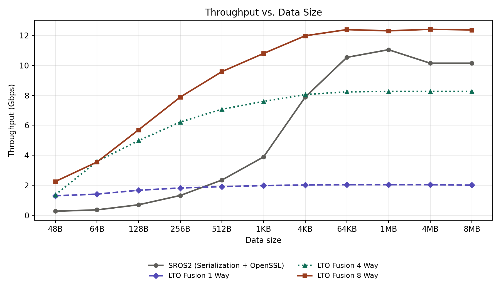
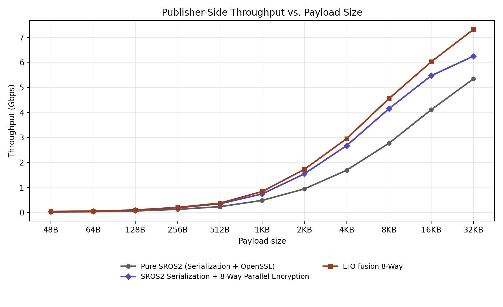
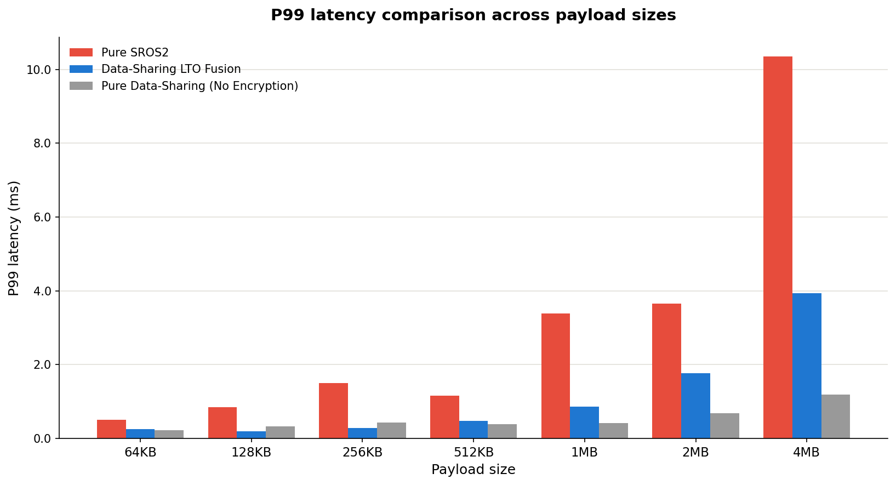

# High-Performance SROS2 Cryptographic Acceleration Framework

##  Executive Summary

Secure, low-latency inter-process communication (IPC) is a first-order design constraint for modern robotic systems. While Robot Operating System 2 (ROS 2) and SROS2 provide standardized security (DDS Security), they treat serialization and encryption as independent, sequential stages. This separation imposes severe CPU bottlenecks, memory-bandwidth costs, and latency spikes—forcing roboticists to choose between real-time performance and cryptographic protection.

This repository presents a unified, hardware-aware acceleration framework that closes this gap. By combining **LLVM Link-Time Optimization (LTO)**, **ARM NEON SIMD vectorization**, and **CUDA GPU acceleration**, this project completely eliminates middleware cryptographic overheads. It delivers physical hardware-limit performance while maintaining **100% standard RTPS network compatibility**.

The repository is structured around three core experimental modules, each targeting a specific layer of the communication stack.

---

##  1. GPU_vs_CPU_SIMD_Acceleration

This baseline module isolates and benchmarks the pure cryptographic compute engines, completely bypassing ROS 2 middleware and network overhead. It proves the foundational mathematical and hardware superiority of our custom cryptographic implementations against standard libraries like OpenSSL.

### Core Engines
* **CPU (ARM NEON SIMD):** Scales up to 8-way parallel execution (128 bytes/cycle). Uses L1-cache key streaming to maximize Instruction-Level Parallelism (ILP) and prevent register spilling.
* **GPU (CUDA Zero-Copy Thunk):** Overcomes standard GHASH sequential dependencies via a 2-pass Parallel Tree Reduction, leveraging Unified Memory to eliminate host-device copy penalties.

### Key Results
* **Edge CPU > Edge GPU:** On the same edge platform (Jetson), the CPU actually outperforms the GPU path for encryption workloads. The Jetson's CPU leverages dedicated **ARMv8 Cryptography Extensions** (analogous to Intel's AES-NI) for massive efficiency. Conversely, the GPU lacks dedicated cryptographic hardware and must implement AES/GHASH via general-purpose bitwise operations, rendering its high parallelism inefficient for this specific task.
* **Instruction-Level Optimization (ARM NEON vs. OpenSSL):** Even without GPU assistance, the pure ARM NEON SIMD implementations bypassed the deep function call chains inherent to the OpenSSL library, demonstrating significantly lower latency and deterministic execution times for standard payload sizes.

**Per-Message Encryption Latency (8MB Payloads)**  
| Configuration | Scope | Latency |
| :--- | :--- | ---: |
| **Jetson CPU (Pure SROS2)** | Encryption | 11.339 ms |
| **Jetson GPU (Thunk)** | Encryption | 28.110 ms |

*Figure 1: The impact of LTO fusion and varying levels of ARM NEON SIMD instruction-level parallelism (1-Way to 8-Way) across different data sizes.*

---

##  2. ROS2_LTO

This module applies the custom CPU SIMD engines to the standard SROS2 network data plane for small-to-medium payloads (< 64KB). 

By injecting a custom LLVM LTO pass (`CryptoFusionPass`), it intercepts the standard `encode_serialized_payload` IR at compile-time. It fuses Fast-CDR serialization and AES-GCM encryption into a **single, intermediate-buffer-free CPU cycle**. This "One-Shot" execution eliminates deep OpenSSL function call chains while generating fully compliant RTPS packets.

### Performance Highlights
* **Massive Throughput Gains:** The LTO Fusion 8-Way architecture drastically outperforms standard SROS2 across all payload sizes.

*Figure 2: Publisher-side throughput comparisons demonstrating the massive performance gains of the LTO Fusion 8-Way architecture against pure SROS2.*

---

##  3. Data_sharing_LTO

This module tackles massive payloads (≥ 64KB) where standard network stack copies halt the CPU. Standard SROS2 cannot secure ROS 2's native zero-copy Data-Sharing (`/dev/shm`) transport without breaking it.

We resolve this by introducing a Secure Zero-Copy Transport. Using an LLVM LTO pass (`ZeroCopyHeistPass`), we seamlessly capture the SROS2 PKI-DH cryptographic keys and fuse AES-256-GCM encryption *directly* into the `/dev/shm` memory copy loop. It appends the MAC tag and IV to the shared memory tail, achieving a 0ns synchronization overhead.

### Performance Highlights
* **Bandwidth Maximization:** Achieves 1.4 GB/s for 4MB payloads, reaching physical memory bandwidth limits.
* **Latency Suppression:** Guarantees deterministic real-time execution for massive sensor payloads (e.g., LiDAR, high-res cameras) without sacrificing security.

*Figure 3: P99 tail latency comparisons demonstrating how the Data-Sharing LTO Fusion approach drastically suppresses latency spikes for large payloads while maintaining security.*
